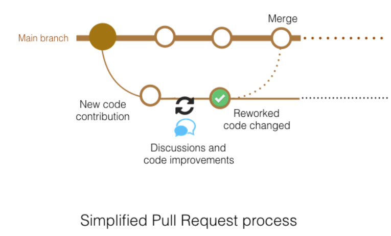

# ada programming principles 1 code exmaples

<a href="https://tenor.com/view/%E5%88%9D%E9%9F%B3%E3%83%9F%E3%82%AF-%E3%83%89%E3%83%83%E3%83%88-gif-13672364668652587540">
  
</a>

```c
printf("hello world");
```

these are the [programs](https://en.wikipedia.org/wiki/Computer_program) we wrote in our programming principles I class at [ADA University](https://www.ada.edu.az/en/schools/site).

these codes were written in reference to Minura Hajisoy's PP1 CRN in 2026 fall sem. (this repo isn't affiliated with her).

if you have any questions regarding the course itself, **please refer to the syllabus**.

## structure & how to test code quickly

the code we wrote per academic week are stored in their respective folders.

if you want to run a program fast without hastling with [gcc](https://gcc.gnu.org/), use the commands in the [makefile](https://makefiletutorial.com/).

`make week-2-math` as an example runs the `math.c` file under the `week-2/` folder

## other notes

do not vibe code or cheat on your assignments. [see why here](https://htmx.org/essays/yes-and/).

vibe coding is fun. [check out an elden ring inspired game that I vibe coded in one prompt using gpt 6 astra low](https://ashen-oath-bay.vercel.app/).

but it simply does not teach you anything. you are only interacting with a _paid service_ offered by a _company_.

## contributors

[Davud Ibrahim](https://github.com/kdiffin/)

[Kamal Badalzada](https://github.com/aslkb)

huge thanks to Minura Hajisoy for her lessons and the example code

## how to contribute

simply send an email and ask to become a contributor `dibrahim19352@ada.edu.az`

or [fork](https://docs.github.com/en/pull-requests/how-tos/work-with-forks/fork-a-repo) the [repository](https://git-scm.com/book/en/v2/Git-Basics-Getting-a-Git-Repository) and submit a [pull request](https://docs.github.com/en/pull-requests/reference/pull-requests)



**do not force push or do destructive git operations please. Rebase responsibly**
